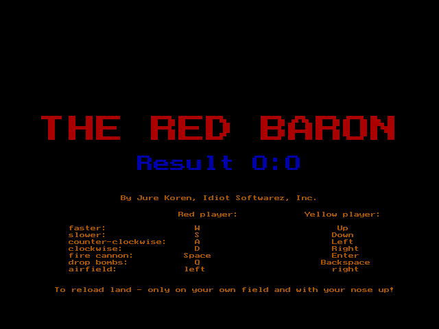

  
  
<a href="baron.exe">Executable</a> <a href="https://www.youtube.com/watch?v=QLy9UzmOmfA">works</a> in <a href="http://www.dosbox.com/">dosbox</a>.

  
<a href="baron.pas">(Borland Turbo) Pascal source code</a> is available.

  
Written in 1995, this action packed aerial adventure game pits two players against
    each other in a battle of rapid keypresses and occasional shouts. One of the
    barons is painted yellow to avoid confusion.

